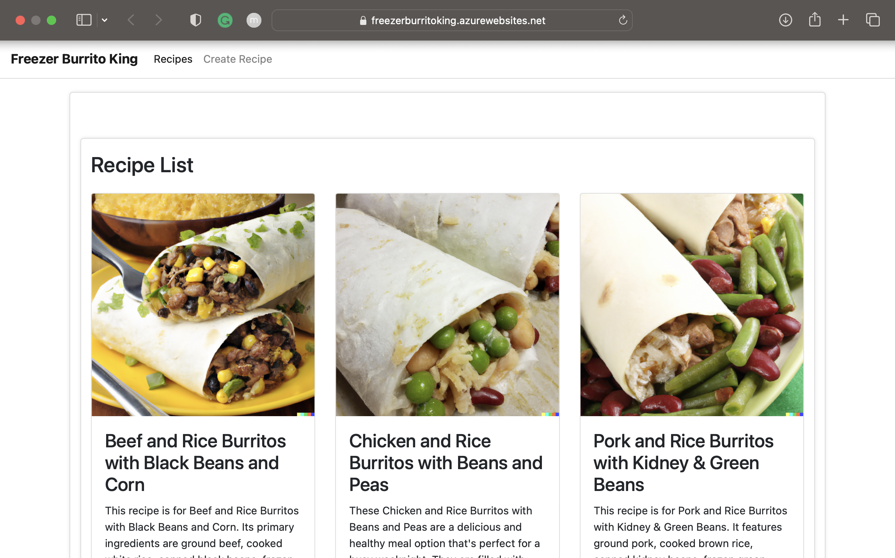

# Django Recipe App with Azure Deployment

Available on Azure at [freezerburritoking.azurewebsites.net](freezerburritoking.azurewebsites.net)

This repository contains the source code and configuration files for a Django Recipe App that uses Bootstrap for the front-end design and JavaScript for displaying recipe details. The purpose of this project is to provide a simple but fully functional example of a Django application that utilizes Bootstrap and JavaScript for styling and dynamic content display.

## Features
The Recipe App has the following features:

- Creation, editing, and deletion of recipes.
- Displaying of recipe details with JavaScript.
- Responsive design using Bootstrap for better mobile viewing.

## Getting Started
To run the Recipe App locally, you need to follow these steps:

1. Clone this repository to your local machine.
2. Install the necessary dependencies by running `pip install -r requirements.txt`.
3. Set up your local database by running `python manage.py migrate`.
4. Load initial recipe data by running `python manage.py loaddata recipes.json`.
5. Run `python manage.py runserver` to start the development server.

## Contributing
Contributions to this project are welcome. If you find a bug or have a feature request, please open an issue. If you want to contribute code, please fork the repository and create a pull request.

## License
This project is licensed under the MIT License. See the [LICENSE](LICENSE) file for more information.
